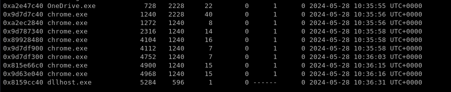
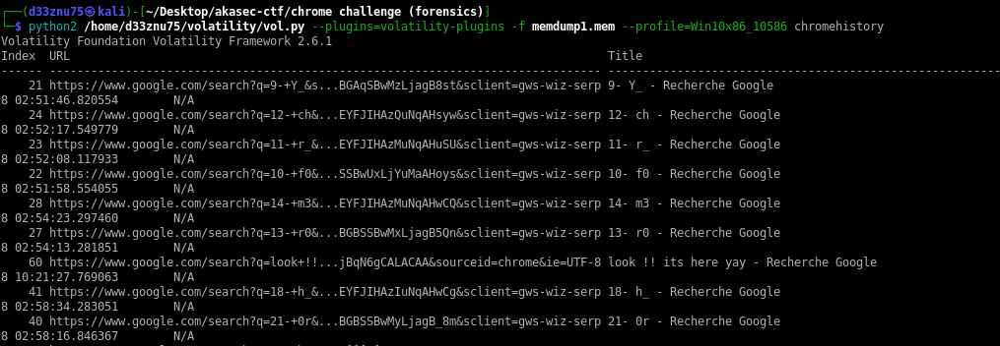

### Portugal :

# Description :

> I accidentally left my computer unlocked at the coffee shop while I stepped away. I'm sure that someone took advantage of the opportunity and was searching for something.

> Author : d33znu75

> Attachment : [memdump1.mem](https://www.mediafire.com/file/7fxn5r9ynwxqj2h/memdump1.mem/file)

In this challenge, we have a memory dump. The challenge description says "was searching for something."

Using Volatility 2, we find the chrome.exe process, so let's check the Chrome history.

I used a Volatility 2 plugin from [superponiblog](https://blog.superponible.com/2014/08/31/volatility-plugin-chrome-history/)

We can see the flag in parts, so let's arrange them.

FLAG : 
> AKASEC{V0L4T1L1TY_f0r_chr0m3_s34rch_h1st0ry}
