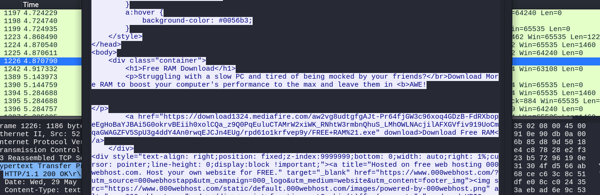
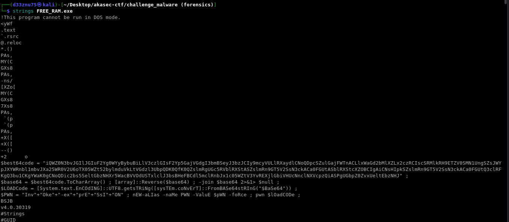
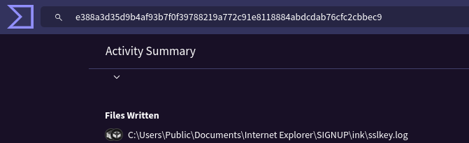
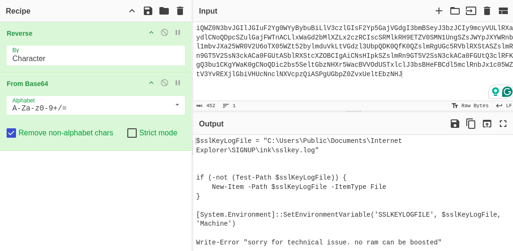
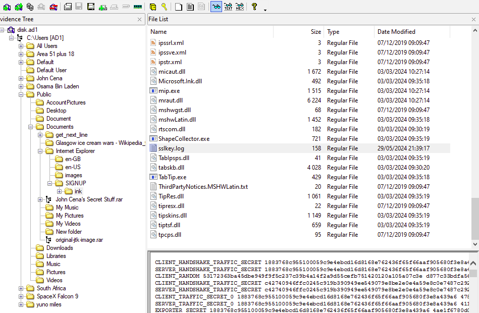
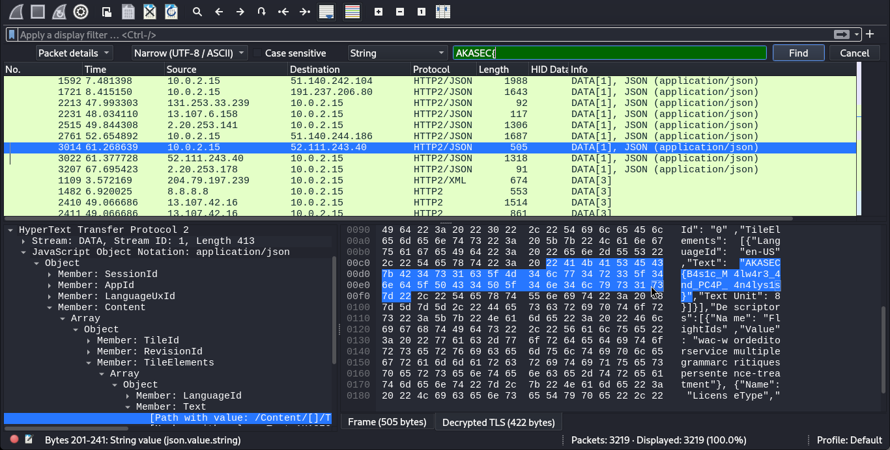

### Sharing is not Caring :

# Description :

> My friends and I use the same computer on campus and have a shared folder to exchange files. After submitting the flag for the challenge, it was leaked, and someone obtained it without my knowledge. I'm unsure how they got it.

> Author : d33znu75

> Attachments : [network.pcapng](https://www.mediafire.com/file/kbml0x3rrjqkwlx/network.pcapng/file) , [disk.ad1](https://www.mediafire.com/file/hn4m2hufc0jzf3a/disk.ad1/file)

Analyzing the pcap file, we find that the user visited two websites:

    1 - A website with a download link for malware.
    2 - A flag submission website.

After downloading the malware and analyzing it, we use two methods:

First, we use the strings command on the file to reveal the PowerShell code.

Alternatively, VirusTotal shows that the malware drops an `sslkey.log` file in `C:\`.

Decoding the PowerShell script, we obtain:

Next, let's look for the file in the `.ad1` image using FTK Imager.

After extracting it, we decrypt the traffic to retrieve the flag.

FLAG : 
> AKASEC{B4s1c_M4lw4r3_4nd_PC4P_4n4lys1s}
