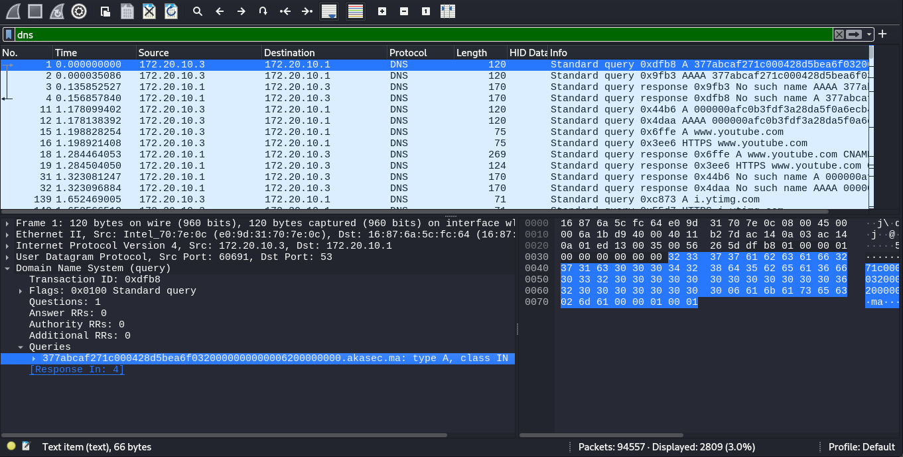
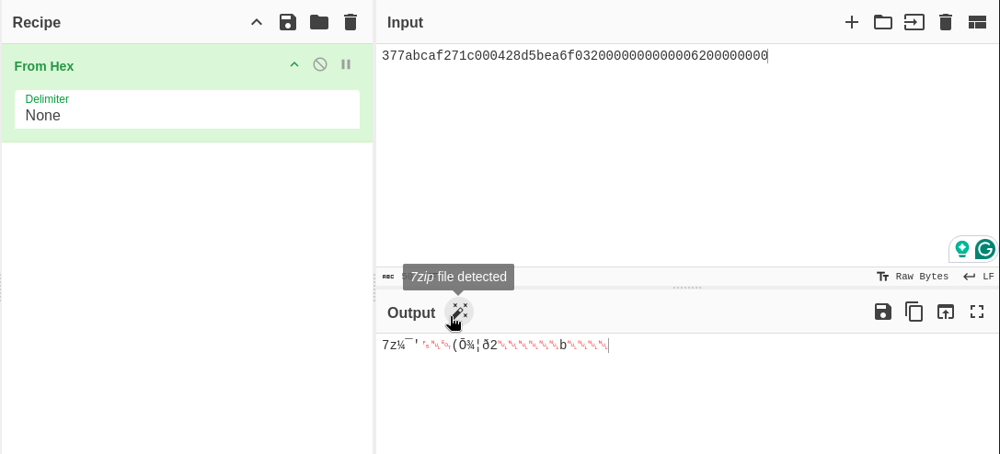
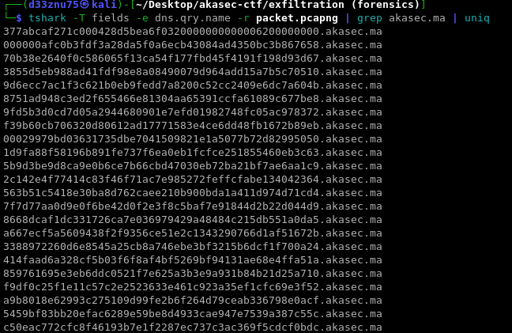
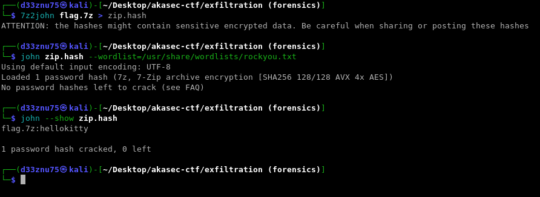
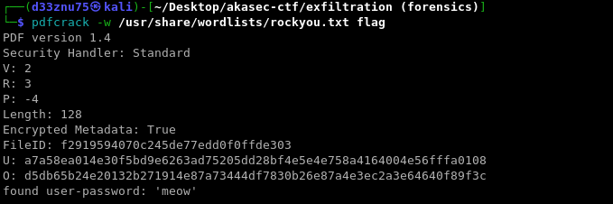
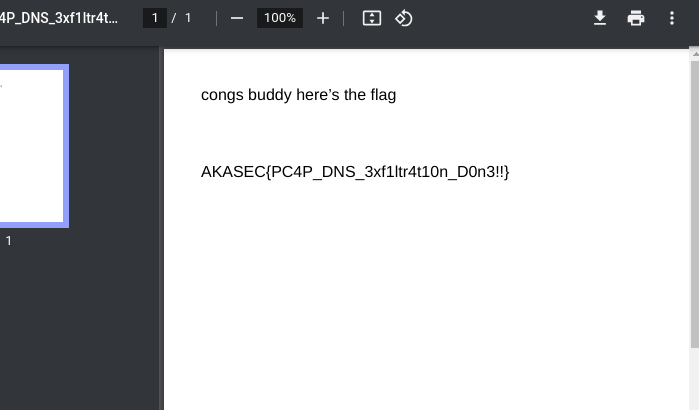

### Sussy :

# Description :

> Something Fishy's Going on in Our Network

> Author : d33znu75

> Attachment : [packet.pcapng](https://www.mediafire.com/file/mghcng82kcl3fo5/packet.pcapng/file)

In this challenge, we have a pcap file. Basic analysis reveals some suspicious requests.



Decoding the first subdomain from hex, we find a 7z extension.



Let's retrieve that zip file by extracting it from the DNS traffic:

```tshark -T fields -e dns.qry.name -r packet.pcapng | grep akasec.ma | uniq | sed 's/.akasec.ma//' | tr -d '\n'```



We discover that the 7z file is password-protected, so let's crack it with John the Ripper.



After extracting the zip, we find another password-protected PDF. Let's crack it using `pdfcracker`.





FLAG : 
> AKASEC{PC4P_DNS_3xf1ltr4t10n_D0n3!!}
