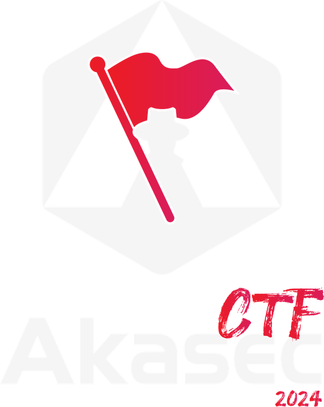

# Akasec-CTF-2024
> Source code for all the challenges posted in Akasec CTF 2024(with some writeups).

 

  

------------------------------

# About us

[Akasec](https://akasec.club) is a cyber security club based in Morocco in a school called [1337](https://1337.ma) which is a part of [42 Network](https://42.fr).

We play [CTFs](https://ctftime.org/team/107202) and [organize](https://ctftime.org/event/2222) them as well.

To be continued...

------------------------------

# Challenges

| Challenge | Difficulty | Category | Solves | Points | Author | Writeup |
| --------- | ---------- | -------- | ------ | ------ | ------ | ------- |
| Lost      | Easy       | [Crypto](https://github.com/AkaSec-1337-CyberSecurity-Club/Akasec-CTF-2024/tree/main/crypto)   | 95     | 100    | [0VN1](https://github.com/sou200) | [Writeup](https://github.com/AkaSec-1337-CyberSecurity-Club/Akasec-CTF-2024/tree/main/crypto#lost) |
| Power Over All | Easy | [Crypto](https://github.com/AkaSec-1337-CyberSecurity-Club/Akasec-CTF-2024/tree/main/crypto) | 61 | 100 | [0VN1](https://github.com/sou200) | [Writeup](https://github.com/AkaSec-1337-CyberSecurity-Club/Akasec-CTF-2024/tree/main/crypto#power-over-all) |
| GCL | Easy | [Crypto](https://github.com/AkaSec-1337-CyberSecurity-Club/Akasec-CTF-2024/tree/main/crypto) | 45 | 100 | [0VN1](https://github.com/sou200) | [Writeup](https://github.com/AkaSec-1337-CyberSecurity-Club/Akasec-CTF-2024/tree/main/crypto#gcl) |
| Twin | Medium | [Crypto](https://github.com/AkaSec-1337-CyberSecurity-Club/Akasec-CTF-2024/tree/main/crypto) | 38 | 281 | [0VN1](https://github.com/sou200) | [Writeup](https://github.com/AkaSec-1337-CyberSecurity-Club/Akasec-CTF-2024/tree/main/crypto#twin) |
| Magic | Medium | [Crypto](https://github.com/AkaSec-1337-CyberSecurity-Club/Akasec-CTF-2024/tree/main/crypto) | 15 | 469 | [0VN1](https://github.com/sou200) | [Writeup](https://github.com/AkaSec-1337-CyberSecurity-Club/Akasec-CTF-2024/tree/main/crypto#magic) |
| My Calculus Lab | Medium | [Crypto](https://github.com/AkaSec-1337-CyberSecurity-Club/Akasec-CTF-2024/tree/main/crypto) | 19 | 449 | [M411K](https://github.com/mwlik) | [Writeup](https://github.com/AkaSec-1337-CyberSecurity-Club/Akasec-CTF-2024/blob/main/crypto/My_Calculus_Lab/solve/solve.py) |
| Portugal | Easy | [DFIR](https://github.com/AkaSec-1337-CyberSecurity-Club/Akasec-CTF-2024/tree/main/DFIR) | 116 | 100 | [d33znu75](https://github.com/RedaHmimchi) | [Writeup](https://github.com/AkaSec-1337-CyberSecurity-Club/Akasec-CTF-2024/tree/main/DFIR/Portugal) |
| Sussy | Easy | [DFIR](https://github.com/AkaSec-1337-CyberSecurity-Club/Akasec-CTF-2024/tree/main/DFIR) | 74 | 100 | [d33znu75](https://github.com/RedaHmimchi) | [Writeup](https://github.com/AkaSec-1337-CyberSecurity-Club/Akasec-CTF-2024/tree/main/DFIR/Sussy) |
| Sharing Is Not Caring 👃 | Medium | [DFIR](https://github.com/AkaSec-1337-CyberSecurity-Club/Akasec-CTF-2024/tree/main/DFIR) | 40 | 257 | [d33znu75](https://github.com/RedaHmimchi) | [Writeup](https://github.com/AkaSec-1337-CyberSecurity-Club/Akasec-CTF-2024/tree/main/DFIR/Sharint%20is%20not%20Caring) |
| Snooz | Medium | [DFIR](https://github.com/AkaSec-1337-CyberSecurity-Club/Akasec-CTF-2024/tree/main/DFIR) | 21 | 436 | [Samaqlo](https://github.com/samaqlo) | [Writeup](https://github.com/AkaSec-1337-CyberSecurity-Club/Akasec-CTF-2024/blob/main/DFIR/Snooz/writeup.md) |
| sperm_rev | Easy | [Reverse](https://github.com/AkaSec-1337-CyberSecurity-Club/Akasec-CTF-2024/tree/main/reverse) | 460 | 100 | [pengo](https://github.com/P3enguin) | [Writeup](https://github.com/AkaSec-1337-CyberSecurity-Club/Akasec-CTF-2024/tree/main/reverse/sperm_rev/README.md) |
| paranoia | Easy | [Reverse](https://github.com/AkaSec-1337-CyberSecurity-Club/Akasec-CTF-2024/tree/main/reverse) | 129 | 100 | miyako | tba |
| grip | Easy | [Reverse](https://github.com/AkaSec-1337-CyberSecurity-Club/Akasec-CTF-2024/tree/main/reverse) | 88 | 100 | miyako | tba |
| risks | Medium | [Reverse](https://github.com/AkaSec-1337-CyberSecurity-Club/Akasec-CTF-2024/tree/main/reverse) | 44 | 205 | miyako | tba |
| packeta | Medium | [Reverse](https://github.com/AkaSec-1337-CyberSecurity-Club/Akasec-CTF-2024/tree/main/reverse) | 17 | 460 | [pengo](https://github.com/P3enguin) | [Writeup](https://github.com/AkaSec-1337-CyberSecurity-Club/Akasec-CTF-2024/tree/main/reverse/packeta/README.md) |
| mips | Hard | [Reverse](https://github.com/AkaSec-1337-CyberSecurity-Club/Akasec-CTF-2024/tree/main/reverse) | 13 | 477 | miyako | tba |
| orgalorg | Hard | [Reverse](https://github.com/AkaSec-1337-CyberSecurity-Club/Akasec-CTF-2024/tree/main/reverse) | 5 | 498 | [pengo](https://github.com/P3enguin) | [Writeup](https://github.com/AkaSec-1337-CyberSecurity-Club/Akasec-CTF-2024/tree/main/reverse/orgalorg/README.md) |
| Upload | Easy | [Web](https://github.com/AkaSec-1337-CyberSecurity-Club/Akasec-CTF-2024/tree/main/web) | 158 | 100 | [S0nG0ku](https://github.com/S0nG0ku0) | [Writeup](https://github.com/AkaSec-1337-CyberSecurity-Club/Akasec-CTF-2024/blob/main/web/Upload/README.md) |
| Flag Checker | Easy | [Misc](https://github.com/AkaSec-1337-CyberSecurity-Club/Akasec-CTF-2024/tree/main/misc) | 42 | 232 | [nyly](https://github.com/imenyoo2) | [Writeup](https://github.com/AkaSec-1337-CyberSecurity-Club/Akasec-CTF-2024/blob/main/misc/Flag%20Checker/README.md) |
| pyJail | Easy | [Misc](https://github.com/AkaSec-1337-CyberSecurity-Club/Akasec-CTF-2024/tree/main/misc) | 84 | 100 | [hel-makh](https://github.com/hel-makh) | [Writeup](https://github.com/AkaSec-1337-CyberSecurity-Club/Akasec-CTF-2024/blob/main/misc/pyJail) |
| so_long | Medium | [Misc](https://github.com/AkaSec-1337-CyberSecurity-Club/Akasec-CTF-2024/tree/main/misc) | 23 | 423 | [hel-makh](https://github.com/hel-makh) | [Writeup](https://github.com/AkaSec-1337-CyberSecurity-Club/Akasec-CTF-2024/blob/main/misc/so_long) |
| format | Medium | [Misc](https://github.com/AkaSec-1337-CyberSecurity-Club/Akasec-CTF-2024/tree/main/misc) | 17 | 460 | [5N0023](https://github.com/5N0023) | [Writeup](https://github.com/AkaSec-1337-CyberSecurity-Club/Akasec-CTF-2024/blob/main/misc/format) |
| Matry-Steg-oshka | Hard | [MISC(stegano)](https://github.com/AkaSec-1337-CyberSecurity-Club/Akasec-CTF-2024/tree/main/misc) | 6 | 496 | [d33znu75](https://github.com/RedaHmimchi) | [Writeup](https://github.com/AkaSec-1337-CyberSecurity-Club/Akasec-CTF-2024/tree/main/misc/Matry-Steg-oshka) |
| warmup | Easy | [Pwn](https://github.com/AkaSec-1337-CyberSecurity-Club/Akasec-CTF-2024/tree/main/pwn) | 63 | 100 | [0ur4n05](https://github.com/0ur4n05) | [Writeup](https://github.com/AkaSec-1337-CyberSecurity-Club/Akasec-CTF-2024/tree/main/pwn/warmup) |
| Good_trip | Easy | [Pwn](https://github.com/AkaSec-1337-CyberSecurity-Club/Akasec-CTF-2024/tree/main/pwn) | 57 |100 | [0ur4n05](https://github.com/0ur4n05) | [Writeup](https://github.com/AkaSec-1337-CyberSecurity-Club/Akasec-CTF-2024/tree/main/pwn/good_trip) |
| Bad_trip | Medium | [Pwn](https://github.com/AkaSec-1337-CyberSecurity-Club/Akasec-CTF-2024/tree/main/pwn) | 41 | 244 | [0ur4n05](https://github.com/0ur4n05) | [Writeup](https://github.com/AkaSec-1337-CyberSecurity-Club/Akasec-CTF-2024/tree/main/pwn/bad_trip_and_the_absolute_horror_of_the_trip) |
| yapping | Medium | [Pwn](https://github.com/AkaSec-1337-CyberSecurity-Club/Akasec-CTF-2024/tree/main/pwn) | 20 | 443 | [nyly](https://github.com/imenyoo2) | [Writeup](https://github.com/AkaSec-1337-CyberSecurity-Club/Akasec-CTF-2024/blob/main/pwn/yapping/README.md) |
| the_absolute_horror_of_the_trip | Hard | [Pwn](https://github.com/AkaSec-1337-CyberSecurity-Club/Akasec-CTF-2024/tree/main/pwn) | 18 | 454 | [0ur4n05](https://github.com/0ur4n05) | [Writeup](https://github.com/AkaSec-1337-CyberSecurity-Club/Akasec-CTF-2024/tree/main/pwn/bad_trip_and_the_absolute_horror_of_the_trip) |
| ZOP | Hard | [Pwn](https://github.com/AkaSec-1337-CyberSecurity-Club/Akasec-CTF-2024/tree/main/pwn) | 16 | 464 | [0ur4n05](https://github.com/0ur4n05) | [Writeup](https://github.com/AkaSec-1337-CyberSecurity-Club/Akasec-CTF-2024/tree/main/pwn/zop) |
| Bytecode | Hard | [Pwn](https://github.com/AkaSec-1337-CyberSecurity-Club/Akasec-CTF-2024/tree/main/pwn) | 12 | 481 | [0ur4n05](https://github.com/0ur4n05) | [Writeup](https://github.com/AkaSec-1337-CyberSecurity-Club/Akasec-CTF-2024/tree/main/pwn/bytecode) |
