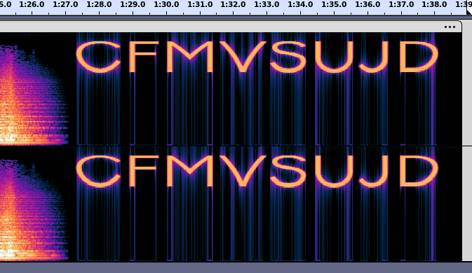
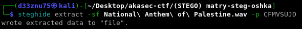
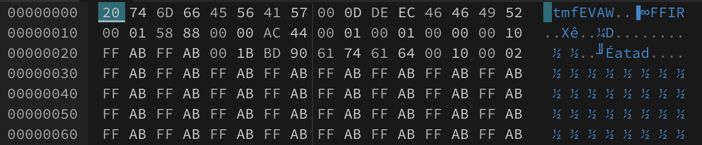
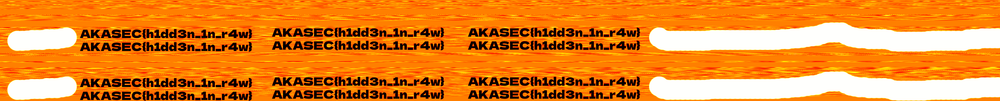

### Matry-Steg-oshka :

# Description :

> I hope you do not get a headache.

> Author : d33znu75

> Hints :
>   "when you hear "the flag is" next part is corrupted, no noise reduction but you can see the flag 😘"
>   "this is a steganography challenege. in the voice audio, the flag hidden in the corrupted part and you must SEE it (it is the reason why it is corrupted). switch it, a tool is needed."

> Attachment : [National_Anthem_of_Palestine.wav](https://www.mediafire.com/file/fp0141309t0y1kh/National_Anthem_of_Palestine.wav/file)

In this challenge, we have an audio WAV file. By opening it with any spectrum analyzer, we find some words at the end of the audio.



Using CFMVSUJD, we extract a file with steghide.



Opening the file with a hex editor, we see that every 16 bytes are reversed. 



Let's run a Python script to fix that.

```py
import sys

def reverse_chunks(file_path, chunk_size=16):
    with open(file_path, 'rb') as f:
        data = f.read()
    
    reversed_data = bytearray()
    
    for i in range(0, len(data), chunk_size):
        chunk = data[i:i+chunk_size]
        reversed_data.extend(chunk[::-1])
    
    output_path = file_path.replace('.wav', '_reversed.wav')
    with open(output_path, 'wb') as f:
        f.write(reversed_data)
    
    print(f"Reversed file saved as {output_path}")

if __name__ == "__main__":
    if len(sys.argv) != 2:
        print("Usage: python reverse_wav.py <file_path>")
    else:
        reverse_chunks(sys.argv[1])
```

We received another audio file of a woman speaking, but there is some noise. The hint says that "we must see it." By converting the WAV file to a PNG using [wav2png](https://directmusic.me/wav2png/), we can see the flag.



FLAG : 
> AKASEC{h1dd3n_1n_r4w}
